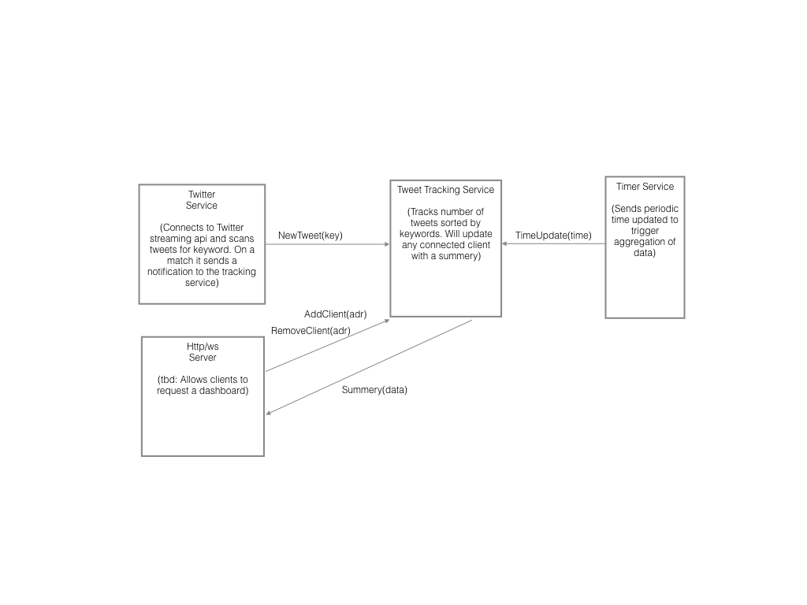

# hear-them-tweet

## Requirements

* Requires Rust (tested with 1.38.0)

* Requires Twitter API credentials

  Create a Json file with name 'credentials.json':
```Json
{
  "api_key": "<your_api_key>",
  "api_secret": "<your_api_secret>",
  "access_token": "<your_access_token>",
  "access_secret": "<your_access_secret>"
}
```

* The 'config.json' file can be edited to change the list of keywords or the http port.

## Dashboard

A simple terminal based dashboard shows the:
* Average Tweets per minute (updates every minute, first time after one minute)
* A simple trend - how much the last minutes differs from the average in percent (updates every minute, first time after two minutes)
* The total number of tweets of the last hour

## Run

Make terminal quite wide, then:
```bash
cargo run
```

Should accept http and websocket requests at 'localhost:8080'

## Architecture

The project contains a few services (at the moment mainly thread, plan to move them all to Actors) loosely coupled communicating over message channels.


